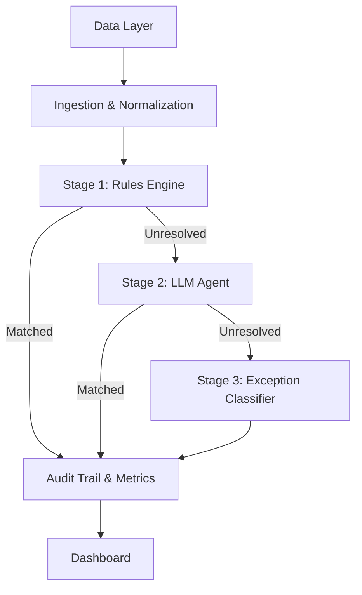

# RazonAgent

RazonAgent is an AI-powered financial reconciliation system that matches transactions across a Payment Gateway, Bank Statement, and Internal Ledger. It uses a 3-stage approach:

1. **Stage 1**: Deterministic rules engine
2. **Stage 2**: LLM reasoning agent (using Google Gemini API)
3. **Stage 3**: Exception classification

## Setup

1. Install dependencies:
   ```bash
   pip install -r requirements.txt
   ```
2. Set your Gemini API Key (free tier available at
   [aistudio.google.com/apikey](https://aistudio.google.com/apikey)):
   ```bash
   cp .env.example .env
   # Edit .env and add your key
   ```
   `llm_agent.py` loads this file automatically via `python-dotenv` — no need
   to export the variable manually in your shell. If `GEMINI_API_KEY` is
   missing or invalid, Stage 2 logs a warning and the pipeline continues
   using only Stage 1 + Stage 3 (deterministic rules + exception
   classification), so the system degrades gracefully rather than failing.

## Running the Pipeline

1. Import public transaction data (downloads UCI Online Retail II and creates
   the three reconciliation views):
   ```bash
   python data/import_public_retail_data.py
   ```
   The source is real public retail data from the UCI Machine Learning
   Repository (CC BY 4.0). The gateway, bank, and ledger CSVs are derived
   views because the public source does not expose private bank/provider data
   for the same invoices.

   To generate synthetic data instead:
   ```bash
   python data/generate_synthetic_data.py
   ```
2. Run the full pipeline end-to-end from the command line:
   ```bash
   python pipeline/run_pipeline.py
   ```
   This writes `eval/metrics_report.md` with the current run's match rate,
   precision/recall/F1, and confusion matrix.
3. Or launch the dashboard, which includes a "Run Full Pipeline" button:
   ```bash
   streamlit run dashboard/app.py
   ```

## Testing

```bash
pytest tests/ -v
```

## Known Limitations (disclosed honestly, not hidden)

- **Stage 2's tool-calling loop is simplified to 2 turns** for this
  prototype (one tool call, one follow-up), rather than a fully general
  agent loop. This was a deliberate scope cut for the hackathon timeline —
  a production version would use a proper multi-turn loop that lets the
  agent call multiple tools before deciding.
- **`MIN_CONFIDENCE = 0.8` is enforced in code** (not just in the system
  prompt) before any Stage 2 match is written to the audit log — but the
  threshold itself is a starting assumption, not tuned against a validation
  set.
- **Ambiguous matches are deliberately skipped, not guessed.** Rule 1 and
  Rule 2 now decline to match when more than one candidate fits, and any
  ledger entry sharing an invoice_ref with another (a duplicate booking) is
  excluded from Stage 1 matching entirely. Measured effect on our synthetic
  batch: false positives dropped from 12 to 1, precision rose from 95.3% to
  99.6%, and exception-classification accuracy rose from 60% to 100% — at
  the cost of match rate dropping from 82.5% to 77.6% (more records now
  correctly fall to Stage 2/3 instead of being force-matched). This is the
  trade-off we intentionally optimized for: a missed match that gets flagged
  for review is far safer than a wrong reconciliation.
- **Exception categories are coarse.** Anything the classifier can't
  confidently place into TIMING_LAG / GENUINE_ANOMALY / DUPLICATE_ENTRY
  falls into a LOW_CONFIDENCE_CANDIDATE bucket.

## Architecture


